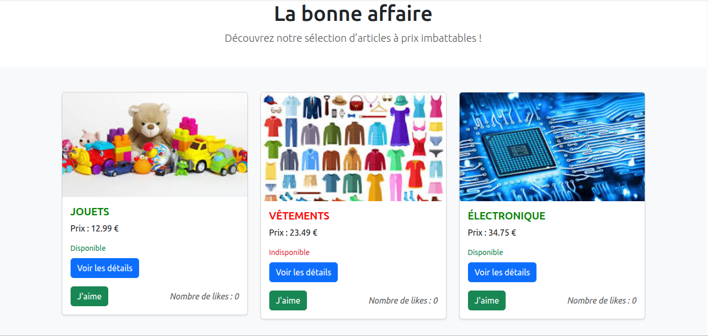
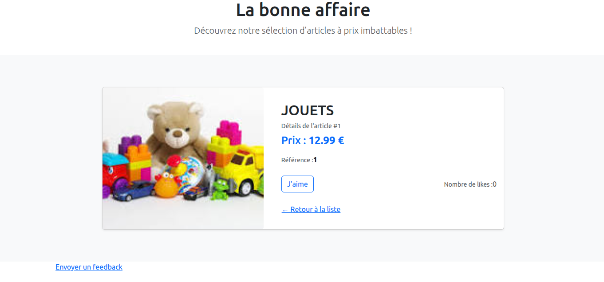

# Labonneaffaire

| ||

## Fonctionnalités

* Affichage d’une liste de produits
* Nom du produit
* Prix
* Bouton **J’aime** avec compteur
* Bouton **Détails** pour voir la description

## Téléchargement

```bash
git clone git@github.com:aliou90/La-bonne-affaire.git
```

## Serveur de développement

Pour démarrer un serveur de développement local, exécutez :

```bash
ng serve
```

Une fois le serveur en cours d'exécution, ouvrez votre navigateur et accédez à :
👉 `http://localhost:4200/`
L'application se rechargera automatiquement à chaque modification des fichiers source.
